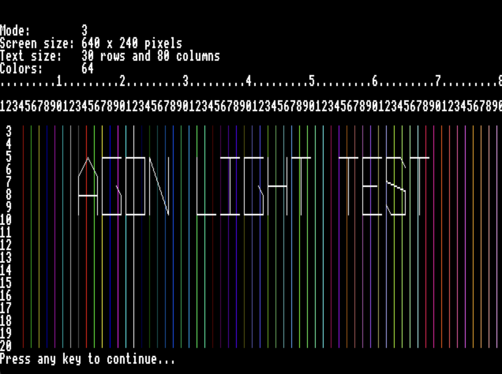

# Agon light - Test program

## Introduction

This is a test program that demonstrates coding the Agon Light in C.
It uses the [CE Toolchain](https://ce-programming.github.io/toolchain/static/getting-started.html) and 
[AgDev - an Agon Light port for it](https://github.com/pcawte/AgDev?tab=readme-ov-file).
Since the VDP integration is not yet finished in this port, I've added two files to this repo that includes
all the functions (including the missing ones):

- ```vdp.c``` VDP function call implementation
- ```vdp.h``` Header file for all VDP functions

This two files will become probaly obsolete in future when AgDev contains all of the functions.
But for now, it was an easy way to get a fast and complete C toolchain for the Agon Light

## Install toolchain

Let's assume you download all to your home folder:

1. Download CE Toolchain from [here](https://ce-programming.github.io/toolchain/static/getting-started.html), and copy it to your home folder. Rename it to **CEDev**.
2. Dowload AgDev from [here](https://github.com/pcawte/AgDev?tab=readme-ov-file) and copy it also to the home folder. Rename it to **AgDev**.
3. Use your terminal and type ```cp -R -f ~/AgDev/ ~CEDev```

Last but not least, add it to your PATH environment variable: ```export PATH=~/AgDev/bin:$PATH```

## Build test

To build the test program, you can now use ```make```. While ```make V=1``` builds in it verbose mode, so you see the different build steps.
If all goes well, you have after a file called ```test.bin``` in the ```bin``` folder.

## Test it

To test it out, I recommend you use the [Fab Agon Emulator](https://github.com/tomm/fab-agon-emulator) and copy ```test.bin``` to the ```sdcard``` folder of the emulator. Or even better, copy it to your SD Card and test it on your Agon Light itself!

No matter which variant you prefer, you can now simply load and run the program with:

```
load test.bin
run
```

*Note: If you are in BBC Basic, you must of course exit first by type in ```*bye```*

**HAVE FUN!**



## References

Of course, it's not all done by myself. Instead, I've looked at many examples at first to get an idea.
Very helpful for this was the [Mandelbrot example](https://github.com/james7780/Agon_C_Mandelbrot) from Jeroen Venema.
He uses the Zilog Developer Studio, but as far as I know it's only available for Windows, while I use macOS.